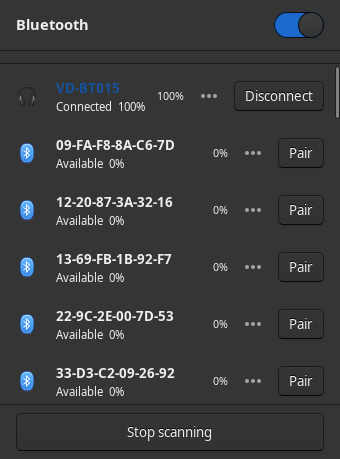
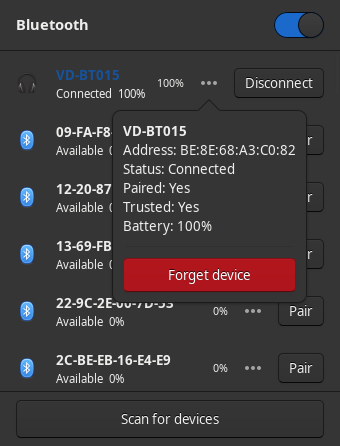

# Nova Bluetooth


[](https://paypal.me/novik133)

A modern, native Bluetooth indicator plugin for the XFCE4 panel. Built with Vala and GTK3, it communicates directly with BlueZ over D-Bus without relying on any external programs.

---

## Features

- **Native XFCE4 panel plugin** -- loads as a shared module, integrates with panel appearance
- **Direct BlueZ D-Bus backend** -- no dependency on `blueman`, `blueberry`, or any external tool
- **Device discovery** -- scan for nearby Bluetooth devices with auto-stop after 30 seconds
- **Connect / Disconnect / Pair** -- manage devices from the popover menu
- **Live status updates** -- reacts to BlueZ property changes in real time via D-Bus signals
- **Battery level display** -- shows battery percentage for devices that support Battery1
- **Adaptive panel icon** -- changes appearance based on Bluetooth state (off, on, connected)
- **Modern popover UI** -- clean design with smooth transitions, respects the active GTK theme
- **Sorted device list** -- connected devices first, then paired, then available

## Screenshots

| Main popup with device list | Device info popover |
|---|---|
|  |  |

## Dependencies

| Package | Minimum version |
|---|---|
| `glib-2.0` | 2.56 |
| `gtk+-3.0` | 3.22 |
| `libxfce4panel-2.0` | 4.14 |
| `libxfce4ui-2` | 4.14 |
| `libxfconf-0` | 4.14 |
| `valac` | 0.40 |
| `meson` | 0.56.0 |
| BlueZ | 5.x (running via D-Bus) |

### Install dependencies (Debian/Ubuntu)

```bash
sudo apt install valac meson libglib2.0-dev libgtk-3-dev \
  libxfce4panel-2.0-dev libxfce4ui-2-dev libxfconf-0-dev
```

### Install dependencies (Fedora)

```bash
sudo dnf install vala meson glib2-devel gtk3-devel \
  xfce4-panel-devel libxfce4ui-devel xfconf-devel
```

### Install dependencies (Arch Linux)

```bash
sudo pacman -S vala meson glib2 gtk3 xfce4-panel libxfce4ui xfconf
```

## Building

```bash
meson setup build
meson compile -C build
```

## Installation

```bash
sudo meson install -C build
```

After installation, right-click the XFCE panel, select **Panel > Add New Items**, and add **Nova Bluetooth**.

## Uninstallation

```bash
sudo ninja -C build uninstall
```

## Project structure

```
nova-bluetooth/
  meson.build                  Root build definition
  CHANGELOG.md                 Release history
  LICENSE                      GPL-2.0-or-later license
  README.md                    This file
  .github/workflows/
    build.yml                  CI for Debian, Fedora, Arch Linux
  data/
    meson.build                Data file installation rules
    nova-bluetooth.css         GTK3 stylesheet for the plugin UI
    nova-bluetooth.desktop.in  XFCE panel plugin descriptor template
  pkg/
    archlinux/PKGBUILD         Arch Linux package build script
    debian/                    Debian packaging files
    fedora/nova-bluetooth.spec Fedora RPM spec file
  src/
    meson.build                Source build definition
    plugin.vala                XFCE panel plugin entry point and registration
    bluetooth/
      dbus_interfaces.vala     D-Bus interface definitions for BlueZ and freedesktop
      manager.vala             Central BlueZ coordinator (ObjectManager watcher)
      adapter.vala             BlueZ Adapter1 wrapper (power, discovery)
      device.vala              BlueZ Device1 wrapper (connect, pair, properties)
    widgets/
      indicator_button.vala    Panel button with adaptive Bluetooth icon
      popover_menu.vala        Dropdown popover with power toggle and device list
      device_list.vala         Scrollable, sorted list of device rows
      device_row.vala          Single device row with status and action button
    utils/
      css_loader.vala          Loads the custom CSS stylesheet at runtime
```

## How it works

1. The plugin registers itself with the XFCE panel via `xfce_panel_module_init`.
2. On load, it connects to BlueZ through `org.freedesktop.DBus.ObjectManager` to enumerate adapters and devices.
3. It listens for `InterfacesAdded` / `InterfacesRemoved` signals to track devices appearing and disappearing.
4. Each adapter and device has a `PropertiesChanged` listener for live state updates.
5. The UI is a GTK3 popover with a power switch, scan controls, and a sorted device list.
6. All styling uses GTK3 CSS with `@theme_*` color references so the plugin matches the active panel theme.

## Support

If you find Nova Bluetooth useful, consider supporting development:

[](https://paypal.me/novik133)

## Author

**Kamil 'Novik' Nowicki**

- Website: [noviktech.com](http://noviktech.com)
- GitHub: [novik133](https://github.com/novik133)
- Repository: [NovaBluetooth](https://github.com/novik133/NovaBluetooth)

## License

This project is licensed under the [GNU General Public License v2.0 or later](https://www.gnu.org/licenses/old-licenses/gpl-2.0.html).
